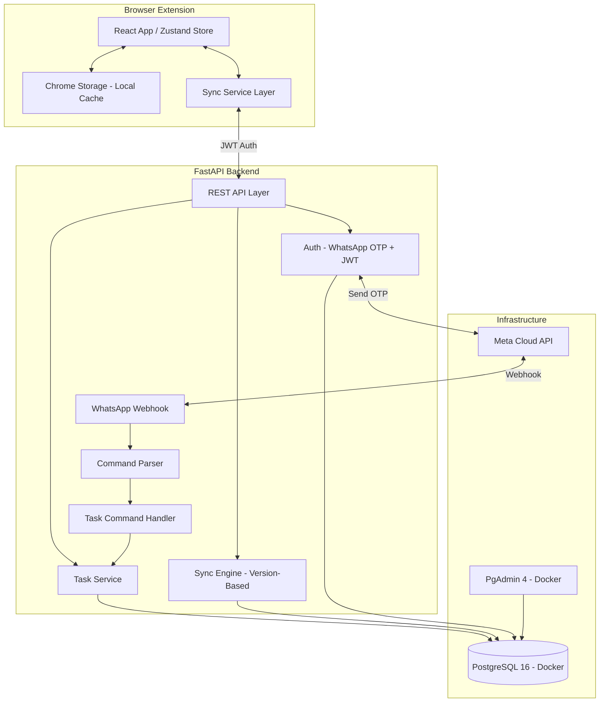
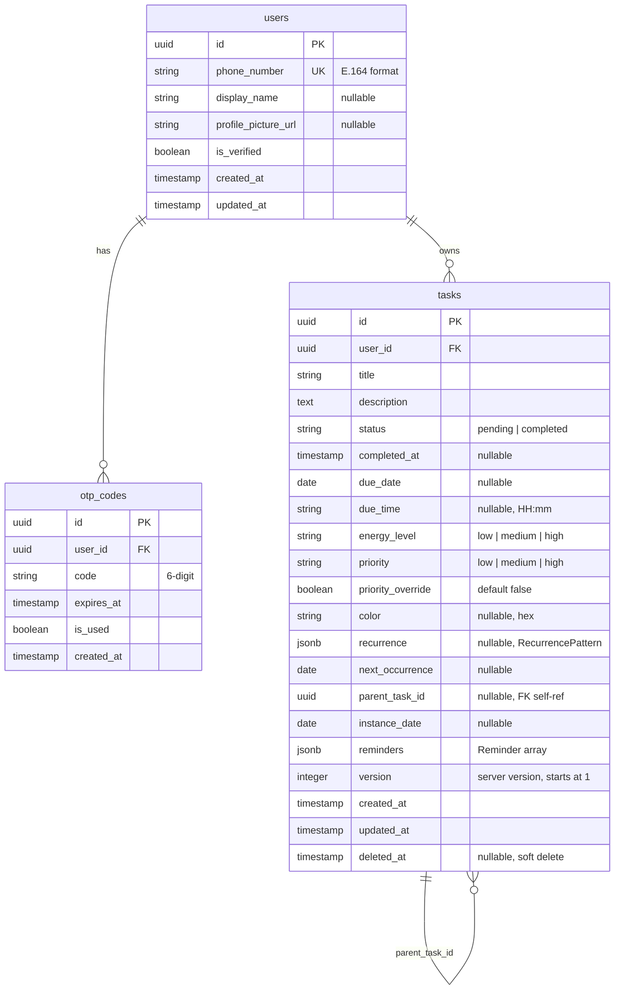

# Live in a Week — FastAPI Backend + WhatsApp Integration (v2)

A production-grade FastAPI + PostgreSQL backend that serves as the source of truth for the "Live in a Week" browser extension, with a WhatsApp bot for task management via Meta Cloud API.

## User Review Required

> [!IMPORTANT]
> **WhatsApp OTP Auth**: Meta Cloud API requires a **verified Business Account** and a dedicated phone number. You'll need to set up a Meta Business app at [developers.facebook.com](https://developers.facebook.com) and get the phone number ID + access token. I'll design the system assuming you'll provide these as env vars.

> [!IMPORTANT]
> **Directory Placement**: The backend will live at `live-in-a-week/backend/`. This keeps it in the same repo and within my workspace access. You can always extract it to a separate repo later if needed.

> [!WARNING]
> **Scope — This Phase Only:** Core auth + task CRUD + sync + WhatsApp task commands.
> **Explicitly out of scope:** Daily cron summaries, NLP, expenses/bookmarks/agentic features (those will be separate backends connected to the same WhatsApp number), projects/tags/parent-child hierarchy, Google integrations.

> [!CAUTION]
> **RecurringTaskTemplate is dead code.** It exists in your types, store, and storage services but **no UI component ever calls `createRecurringTask`**. The `Task` model already has a `recurrence` field for repeating tasks. The backend will **not** include a separate templates table — recurrence is handled directly on tasks. We can clean up the extension code separately.

---

## System Architecture



> [!NOTE]
> **WhatsApp Number Sharing**: Since other apps (expenses, bookmarks, etc.) will have **separate backends**, you'll eventually need a lightweight **WhatsApp Gateway** service that sits in front and routes messages to the correct backend based on context. That's a future concern — for now, this backend handles all messages to that number, and we'll add routing later when the second app comes online.

---

## Database Schema



**Key decisions:**
- **No `recurring_task_templates` table** — recurrence is a JSONB field on `tasks` (matches your existing `Task.recurrence` field)
- **No `whatsapp_sessions` table** — this backend only handles task commands, no multi-app context switching needed
- **Soft deletes** — `deleted_at` column so sync can propagate deletions to other devices
- **`parent_task_id`** — self-referential FK, ready for future parent/child task hierarchy

---

## Proposed Changes

### Project Structure

```
live-in-a-week/
├── src/                        # Existing extension code
├── backend/                    # NEW — FastAPI backend
│   ├── alembic/                # DB migrations
│   │   ├── versions/
│   │   └── env.py
│   ├── app/
│   │   ├── __init__.py
│   │   ├── main.py             # FastAPI entry point
│   │   ├── config.py           # Pydantic settings from .env
│   │   ├── database.py         # Async SQLAlchemy engine
│   │   ├── models/
│   │   │   ├── __init__.py
│   │   │   ├── user.py         # User + OTPCode
│   │   │   └── task.py         # Task (with recurrence JSONB)
│   │   ├── schemas/
│   │   │   ├── __init__.py
│   │   │   ├── auth.py
│   │   │   ├── task.py
│   │   │   └── sync.py
│   │   ├── api/
│   │   │   ├── __init__.py
│   │   │   ├── deps.py         # get_current_user dependency
│   │   │   ├── auth.py         # /auth/*
│   │   │   ├── tasks.py        # /tasks/*
│   │   │   ├── sync.py         # /sync/*
│   │   │   └── webhook.py      # /webhook/whatsapp
│   │   ├── services/
│   │   │   ├── __init__.py
│   │   │   ├── auth_service.py
│   │   │   ├── task_service.py
│   │   │   ├── sync_service.py
│   │   │   └── whatsapp_service.py
│   │   └── bot/
│   │       ├── __init__.py
│   │       ├── parser.py       # Slash command parser
│   │       └── handler.py      # Task command handler
│   ├── tests/
│   │   ├── conftest.py
│   │   ├── test_auth.py
│   │   ├── test_tasks.py
│   │   ├── test_sync.py
│   │   └── test_whatsapp.py
│   ├── alembic.ini
│   ├── requirements.txt
│   ├── Dockerfile
│   ├── docker-compose.yml      # PostgreSQL + PgAdmin + Backend
│   ├── .env.example
│   └── README.md
```

---

### Component 1: Docker Compose + Infrastructure

#### [NEW] [docker-compose.yml](file:///c:/Users/kaushal.joshi/projects/archives/live-in-a-week/backend/docker-compose.yml)

- **PostgreSQL 16** container on port `5432`, volume-mounted for data persistence
- **PgAdmin 4** container on port `5050` — browse your DB at `http://localhost:5050`
- **Backend** container with hot reload via volume mount
- Shared Docker network between all services

```yaml
# Simplified preview
services:
  db:
    image: postgres:16-alpine
    ports: ["5432:5432"]
    volumes: [pgdata:/var/lib/postgresql/data]
  
  pgadmin:
    image: dpage/pgadmin4
    ports: ["5050:80"]
    depends_on: [db]
  
  backend:
    build: .
    ports: ["8000:8000"]
    depends_on: [db]
    volumes: [./app:/app/app]  # hot reload
```

> [!TIP]
> You can also connect any external PostgreSQL client (DBeaver, TablePlus, etc.) to `localhost:5432`. PgAdmin is included for convenience but not required.

---

### Component 2: Auth System (WhatsApp OTP)

#### [NEW] [api/auth.py](file:///c:/Users/kaushal.joshi/projects/archives/live-in-a-week/backend/app/api/auth.py)

| Endpoint | Method | Description |
|---|---|---|
| `/auth/request-otp` | POST | Sends 6-digit OTP via WhatsApp template message |
| `/auth/verify-otp` | POST | Verifies OTP → creates user if new → returns JWT |
| `/auth/me` | GET | Returns current user profile |
| `/auth/me` | PATCH | Update display_name, profile_picture_url |
| `/auth/refresh` | POST | Refresh JWT token |

**Auth Flow:**
```
Extension → POST /auth/request-otp {phone: "+91XXXXXXXXXX"}
         ← 200 OK
WhatsApp → User receives "Your OTP is 123456"
Extension → POST /auth/verify-otp {phone: "+91XXXXXXXXXX", code: "123456"}
         ← 200 {access_token: "eyJ...", user: {...}}
```

- OTP expires in 5 minutes, single-use
- JWT issued with HS256, configurable expiry (default 7 days)
- All other endpoints require `Authorization: Bearer <token>` header

---

### Component 3: Task CRUD API

#### [NEW] [api/tasks.py](file:///c:/Users/kaushal.joshi/projects/archives/live-in-a-week/backend/app/api/tasks.py)

| Endpoint | Method | Description |
|---|---|---|
| `/tasks` | GET | List tasks (filters: status, date_range, energy_level, search) |
| `/tasks/{id}` | GET | Get single task |
| `/tasks` | POST | Create task (server assigns version=1) |
| `/tasks/{id}` | PATCH | Update task (requires `version` for optimistic locking) |
| `/tasks/{id}` | DELETE | Soft delete (sets `deleted_at`, bumps version) |

- Every mutation increments `version` server-side
- Users can only access their own tasks (scoped by JWT)
- Recurrence stored as JSONB — same shape as your existing `RecurrencePattern` type

---

### Component 4: Sync Engine

**Protocol:**
```
1. Extension boots → GET /sync/pull?since={lastSyncTimestamp}
2. Server returns tasks modified after that timestamp
3. Extension applies changes to local cache
4. Extension sends local changes → POST /sync/push {changes: [...]}
5. Server checks each: if server_version == client_version → accept
                        if server_version > client_version → CONFLICT
6. Returns accepted/conflicted results per change
7. Conflicts: server wins by default
```

#### [NEW] [api/sync.py](file:///c:/Users/kaushal.joshi/projects/archives/live-in-a-week/backend/app/api/sync.py)

| Endpoint | Method | Description |
|---|---|---|
| `/sync/pull` | GET | Returns tasks updated since `?since=` timestamp |
| `/sync/push` | POST | Batch push local changes with conflict detection |

---

### Component 5: WhatsApp Bot (Tasks Only)

#### [NEW] [api/webhook.py](file:///c:/Users/kaushal.joshi/projects/archives/live-in-a-week/backend/app/api/webhook.py)
- `GET /webhook/whatsapp` — Meta verification (challenge-response)
- `POST /webhook/whatsapp` — Incoming message handler with HMAC signature verification

#### [NEW] [bot/parser.py](file:///c:/Users/kaushal.joshi/projects/archives/live-in-a-week/backend/app/bot/parser.py) + [bot/handler.py](file:///c:/Users/kaushal.joshi/projects/archives/live-in-a-week/backend/app/bot/handler.py)

**Supported commands:**

| Command | Action | Example Response |
|---|---|---|
| `/today` | List today's tasks | `📋 Today (Apr 22): 1. ☐ Review PR 🔴 ...` |
| `/week` | Pending tasks from today → Sunday | `📋 This Week: Mon: ... Tue: ...` |
| `/add <title>` | Create task for today | `✅ Added: "Buy groceries"` |
| `/add <title> on <date>` | Create task for specific date | `✅ Added: "Meeting" on Apr 25` |
| `/done <number>` | Complete task by list position | `☑ Completed: "Review PR"` |
| `/delete <number>` | Delete task by list position | `🗑️ Deleted: "Old task"` |
| `/help` | Show available commands | List of all commands |

- User is identified by their WhatsApp phone number (matches `users.phone_number`)
- If phone not registered, bot replies with instructions to set up in extension first

---

### Component 6: Extension Sync Layer

#### [NEW] [apiClient.ts](file:///c:/Users/kaushal.joshi/projects/archives/live-in-a-week/src/services/apiClient.ts)
- Fetch wrapper with JWT header injection and auto-refresh on 401

#### [NEW] [syncService.ts](file:///c:/Users/kaushal.joshi/projects/archives/live-in-a-week/src/services/syncService.ts)
- `pullFromServer()` / `pushToServer()` / `startBackgroundSync()`
- Server wins on conflict, user gets a toast notification

#### [MODIFY] [chromeStorage.ts](file:///c:/Users/kaushal.joshi/projects/archives/live-in-a-week/src/services/chromeStorage.ts)
- Add `lastSyncedAt` tracking to storage

---

## Verification Plan

### Automated Tests
```bash
cd backend
docker compose up -d db
pytest tests/ -v
```

| Test Suite | Coverage |
|---|---|
| `test_auth.py` | OTP request/verify, JWT, profile update, expired/wrong OTP |
| `test_tasks.py` | CRUD, filters, soft delete, version bumps, authorization |
| `test_sync.py` | Pull since timestamp, push accepted/conflict, batch mixed |
| `test_whatsapp.py` | Webhook verify, signature check, all commands, unregistered user |

### Manual Verification
1. `docker compose up` → Swagger UI at `http://localhost:8000/docs`
2. PgAdmin at `http://localhost:5050`
3. Auth flow via Swagger → OTP → JWT → protected routes
4. WhatsApp testing via ngrok tunnel or deployed endpoint
